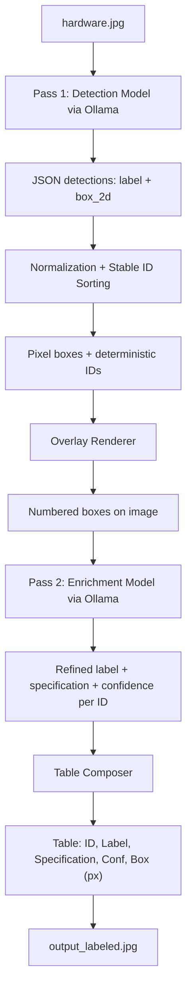

# Fastener-Finder


Fastener-Finder analyzes a photo of mixed hardware (screws, nuts, washers, springs, etc.), assigns a stable number to each part, and generates a labeled output image with a structured table.

The main script is `hardware_test.py`.

## What It Does (Non-Technical)

You give the script one image (`hardware.jpg`) with random hardware pieces on a surface.

The script:
1. Finds each visible part in the image.
2. Draws a red box around each part.
3. Places a large ID number near each box (`1, 2, 3...`).
4. Creates a table next to the image that lists each ID, what the part is, and a short description.
5. Saves one combined output image: `output_labeled.jpg`.

This makes it easy to visually match each physical part to its row in the table.

## How The Model Works

The workflow uses two model passes through [Ollama](https://ollama.com/):

1. Detection pass:
   - The model returns a JSON list of detected objects.
   - Each object includes a class label and a bounding box.
   - Bounding boxes are normalized and converted to pixel coordinates.
2. Enrichment pass:
   - The script sends the numbered image back to the model.
   - The model refines the label and generates a short specification and confidence score per ID.

If the model output is noisy or malformed, the script uses robust JSON recovery logic so it can still proceed whenever possible.

## Architecture (At a Glance)

```text
hardware.jpg
    |
    v
[Pass 1: Detection Model via Ollama]
    -> JSON detections (label + box_2d)
    |
    v
[Normalization + Stable ID Sorting]
    -> pixel boxes + deterministic IDs
    |
    v
[Overlay Renderer]
    -> numbered boxes on image (temporary numbered image)
    |
    v
[Pass 2: Enrichment Model via Ollama]
    -> refined label + specification + confidence per ID
    |
    v
[Table Composer]
    -> ID | Label | Specification | Conf | Box (px)
    |
    v
output_labeled.jpg
```



## Input and Output

- Input image: `hardware.jpg`
- Script: `hardware_test.py`
- Output image: `output_labeled.jpg`

## Table Columns

The output table currently includes:
- `ID`: Number shown on the image
- `Label`: Fastener type from model/classifier
- `Specification`: Human-readable details (or heuristic fallback)
- `Conf`: Confidence score (0.00 to 1.00)
- `Box (px)`: Bounding box coordinates in pixel space

## Requirements

- Python 3.10+
- [Ollama](https://ollama.com/) installed and running
- A vision-capable model available in Ollama (configured in script as `qwen3-vl`)
- Python packages:
  - `ollama`
  - `Pillow`

Install dependencies:

```bash
pip install ollama pillow
```

## Run

From the project folder:

```bash
python hardware_test.py
```

After completion, open:

```text
output_labeled.jpg
```

## Notes and Limitations

- The model may occasionally miss small parts or merge nearby parts.
- Part “specification” text is inferred from appearance and may be approximate.
- Confidence values come from model self-assessment and should be treated as guidance, not ground truth.

## Troubleshooting

- If no output appears:
  - Confirm `hardware.jpg` exists in the repository root.
  - Confirm Ollama service is running.
  - Confirm the selected model name exists locally.
- If boxes look misplaced:
  - Ensure the model returns boxes in expected XYXY format.
  - Review logged `Model Response` in terminal for malformed coordinates.

## References

- Ollama documentation: https://github.com/ollama/ollama
- Pillow documentation: https://pillow.readthedocs.io/
